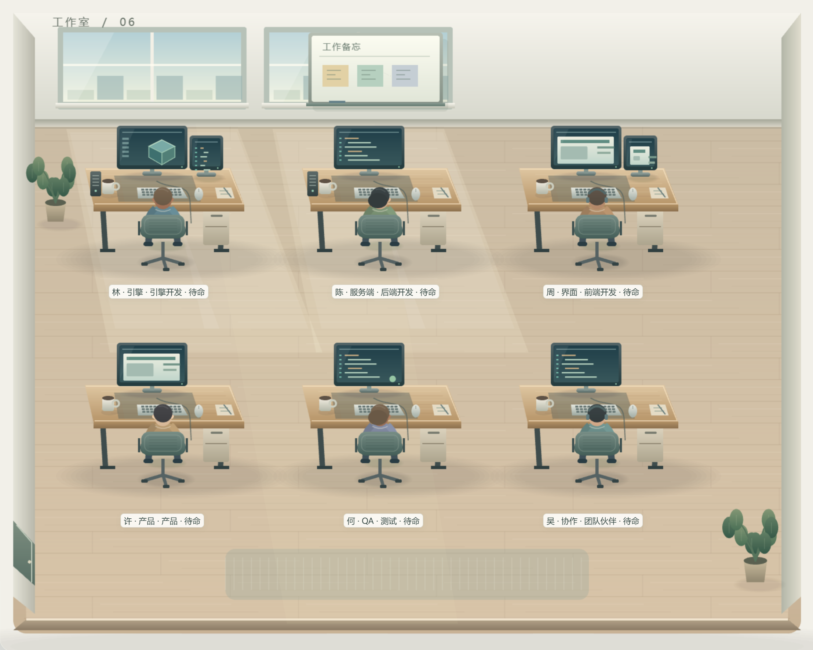

# P6 交付：会议删除与办公室重绘

日期：2026-10-07。工作分支：`feature/office-collab`。本次仅本地交付，不推送 origin、fork 或其他远端。

## 本地提交状态：受环境权限阻塞

代码、截图及验证已完成，但本次会话只允许读取 `.git`，无法写入 Git 索引。执行定向 `git add` 返回：

`fatal: Unable to create '.../portal-desktop/.git/index.lock': Permission denied`

因此**没有成功暂存或 commit**，不能把本交付描述为已提交；没有尝试绕过权限，也没有推送远端。当前分支已确认仍为 `feature/office-collab`。恢复 Git 写权限后，在仓库根目录执行：

```powershell
git add -- P6-DELIVERY.md desktop/main/office/registry.ts desktop/shared/office.ts desktop/renderer/pipeline/office 'tests/office*.test.ts' 'tests/office-*-ui.mjs' tests/office-ui.mjs tests/office-production.mjs
git commit -m "feat(office): remove meetings and redraw adaptive studio"
```

以上路径只覆盖本次 office 改动，不包含原有未跟踪的任务书、运行脚本或 `%SystemDrive%/`。

## A. 删除了什么

- 删除 `MeetingController`、会议会话与成员生命周期、会议反馈入口、会议专属显隐管理和会议 CSS。
- IPC 输入不再接受 `meeting-start/join/leave/end`；主进程不再保存或维护会议集合。
- 删除 `meeting.ts`、`tests/office-meeting.test.ts` 和 `tests/office-p3-ui.mjs`；P4 的会议验收改为真实工位交接与工作/思考/走动帧验收。
- 移除 `officeMeetings` 插件、`starmap.meeting` 能力及会议专用交互槽。普通工作白板、房间、工位、人物、导航和可见性机制保留。
- 保留实况过期/离线处理、去重、事件顺序、交接确认与取消、人类审核约束、生产环境测试注入禁用及第三方许可。

## B. 重绘与活感

### 画面

- 房间改为暖灰墙面、木地板拼缝与纹理、窗框/天空/远景、侧墙透视、踢脚线、透光光带、反光与柔影；加门、绿植和织物地毯。
- 工位重新绘制木桌台面与边缘、桌腿/抽屉、屏幕支架、角色化屏幕内容、键盘键帽、鼠标、咖啡杯、笔记本/笔、线缆与主机通风口。
- 椅子有支柱、椅背网格、扶手和脚轮；人物有自然头身比例、皮肤/衣服渐变、头发、眼镜/耳机变化、工作与思考姿态、行走步态与脚下阴影。
- 全部办公室美术为本地 Pixi 程序化绘制，使用系统字体，没有新增图片、CDN、网络字体或依赖。房间/家具静态缓存、人物帧纹理复用，原始上游 PNG 不参与渲染。
- 主办公室视图根据窗口释放更大的画面空间，窄屏摘要和独立协作舱保留；标签仍避开家具与其他标签。

### 数据与角色

- 人物和工位数量来自实际 office roster；零人不画装饰性假伙伴，布局按人数伸缩，增员保留已有工位位置，减员收拢构图。
- 身份新增可选 `role`、`responsibilities`，优先用明确角色，再用职责/名称/owner 推断引擎、后端、前端、产品、测试；未知角色显示“团队伙伴”。身份原有衣服颜色保留。
- 角色区别体现在标签、单/双屏、引擎图形视图、后端代码、前端页面与测试指示等工位细节，不依赖固定的三人或六人模板。

### 动态与交互

- 入场与退场复用现有网格寻路，从门走到工位、从工位走出；连续增减员保留已在进行的路径与当前位置，入场中离开可原路折返，不以瞬移或淡入淡出代替走动。
- 状态/坐姿/朝向使用约 240ms 帧过渡；工作时屏幕代码/图表轻动，思考有轻动的思考点，讨论状态标签微亮。
- 屏幕光晕落到桌面/人物，窗光缓慢变化；hover/选中人物或工位有约 280ms 缓动高亮、轻放大与标签强调，有限缓动结束落到准确终值。
- 可见 idle 复用低频呼吸定时器，不新增常驻 ticker；OS `prefers-reduced-motion` 实时生效并优先于手动开关，所有动画静止。折叠、切离视图、页面不可见时不绘制，交接取消仍可做数据收尾。

## 验证结果

| 项目 | 结果 | 关键覆盖 |
| --- | --- | --- |
| npm test 的 office 模块 | **12 个文件 / 45 项全过** | 原有状态、实况、顺序/容量、交接、导航、P5；新增 15 项 P6，含 0/1/2/3/6/10/100 人布局、路径、角色和会议输入拒绝 |
| `tests/office-ui.mjs`（P1） | **15/15** | 原审核流程、节点工作状态、点击/导航、快捷键隔离、折叠与 20 次开合；最终状态投影实测 161ms，原 250ms 断言未放宽 |
| `tests/office-p2-ui.mjs`（P2） | **11/11** | 实况独立、去重/旧 run、确认交接、取消、离线重连、节点来源、隐藏不重放及动态注销 |
| `tests/office-p4-ui.mjs`（生产） | **5/5** | 离线绘制、本地许可、生产协议、禁止开发注入、20 次切换无资源增长、工作/思考/走动及工位交接、大名册追加 |
| `tests/office-p5-ui.mjs` | **6/6** | 开发及最终生产实例均通过；主视图复用、两种小窗口、家具/标签避让、任务返回、演示标注、呼吸/减弱动态 |
| `tests/office-p6-ui.mjs`（最终生产） | **6/6** | 实际 IPC 的 0→1→6→10→1 人；入场位移、连续入退场、角色、工作/思考帧、hover 放大与收尾、实时系统减弱动态、隐藏零绘制 |
| 生产启动 smoke | **通过** | `beings://desktop/`，原 CSP，HTTP/HTTPS/WS/WSS 阻断，单 Pixi canvas，本地 MIT 许可 |
| `npm run typecheck` / `npm run build` | **均通过** | 生产构建 1345 个模块；仅既有依赖注释/大 chunk 提示 |
| `git diff --check` | **通过** | 无补丁空白错误 |

生产循环关键指标保持：1 个 Application、3 个 runtime listener、2 个 ticker listener、1 个 scene subscription、1 个 ResizeObserver；最终位置不一致计数为 0。减弱动态与折叠验证各观察 1800ms，持续绘制增量为 0。

### 隔离与复验说明

- 开发及生产验证只使用 **9225**，各用自己的独立 user-data。未操作 9223/9224 的进程，未推送任何远端。
- 最终生产夹具由 `tests/office-production.mjs` 创建，并依次跑 P4/P5/P6；退出后自动删除夹具与 profile。本次开发隔离实例也已退出，9225 已释放，临时 `.p6-run` 与 user-data 已删除。
- 本机沙箱禁止 esbuild 读取仓库上级目录；验证临时使用指向本仓库的 Q: 映射和真实 esbuild 二进制路径。office 单测实际通过 `npm test -- tests/office` 加等价临时配置运行，保留项目 include 与 Windows 串行执行规则，未修改项目测试配置。
- 当前隔离环境的独立 GPU 子进程无法正常启动，因此验证启动参数增加测试专用 `--in-process-gpu --no-sandbox`。没有把这些参数写入产品的启动配置或打包配置。
- P1 必须在新主进程的演示注册表上先运行；P2 测试注入和 P6 实况注册会改变身份来源/事件序号，不应把污染后的演示状态当作 P1 的前置。生产夹具是另起的独立注册表。

## 人工验收截图

目录：`desktop/renderer/pipeline/office/p6-screenshots/`。最终截图来自生产夹具的真实 CDP 抓屏，DPR=2，没有后处理放大。

| 文件 | 像素 | 内容 |
| --- | --- | --- |
| `01-office-panorama.png` | 2216 × 1772 | 六人办公室全景 |
| `02-workstation-detail.png` | 546 × 650 | 引擎工位、双屏、键盘/杯子/线缆、桌椅细节 |
| `03-character-detail.png` | 326 × 340 | 工位人物与思考姿态 |
| `04-office-in-context.png` | 4400 × 3400 | 办公室在真实客户端 UI 中的构图 |
| `05-ten-people.png` | 2216 × 1772 | 十人自动布局 |
| `06-walking-character.png` | 420 × 420 | 行走中人物近景 |



## 已知限制

- 这是细节化的程序化二维工作室插画，不是照片级三维渲染；截图与功能自动验收已完成，最终审美/保真度是否达到 owner 预期仍需人工确认。
- 验收角色与人数经真实 IPC 注册，但使用的是隔离测试名册，不等同于已连接现实开发团队。上游 Being 需要提供 `role`/`responsibilities` 才能得到明确方向；缺失时使用已有信息推断和默认角色。
- UI 实测覆盖至 10 人，100 人的数量/布局/寻路通过单测；未做 100 人长时间 GPU 性能压测，超大团队缩小后仍可能需要摘要/列表查看细节。
- 生产验证是本地 packaged-mode 夹具，不是正式安装包、签名、发布或原生 GPU 子进程的多机器验证；本次没有 make/release，也没有远端操作。
