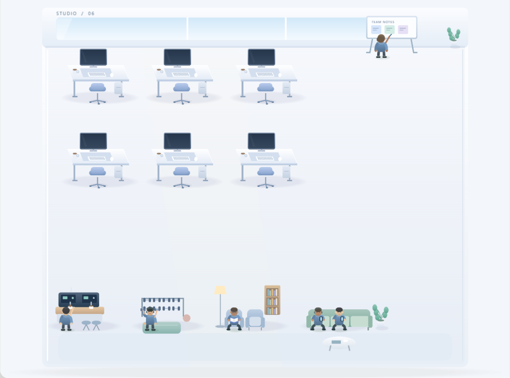
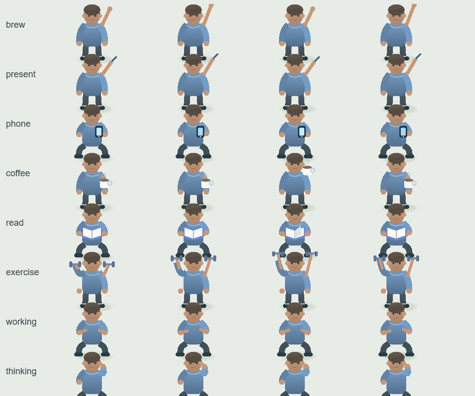
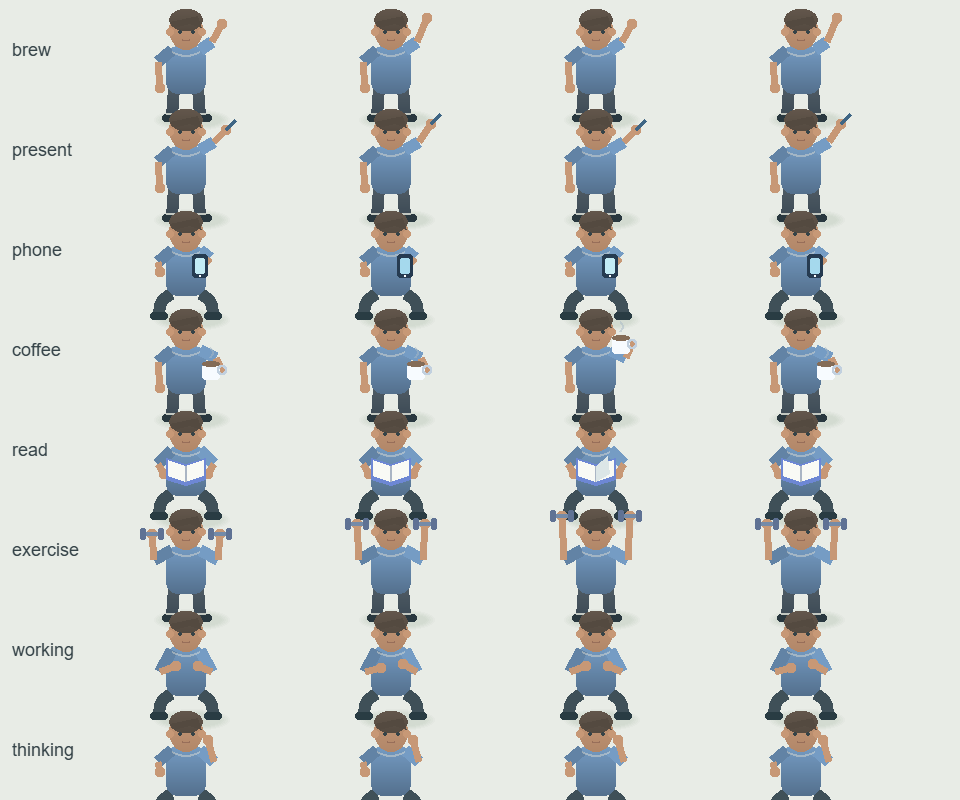

# P6R4 办公室伸手多臂返修交付

## 结论与边界

- 日期：2026-10-09，时间均为 UTC+8；分支：`feature/office-collab`。
- 基于现有 `c476305` 继续修复；该提交已经位于 `942d9bc` 之后，保留其 UI 采样与减少动态效果修正，没有回退历史提交。
- 已在自建 **9224 + 全新 user-data** 实例实拍复现和复验。伸手时原手臂参与动作，肩、肘、腕连续连接，画面不再保留第三只静止手；杯子、笔和哑铃跟随对应腕点。
- 原办公室 **84/84** + 新增绘图 **14/14** = **98/98**；六套现有 UI 回归 **53/53**；`tsc --noEmit` **0 诊断**；renderer 生产构建通过，生产态 harness 通过。
- 只交付办公室绘图源码、新增办公室测试、本报告和 P6R4 图片。没有连接、操作或终止人类伙伴的 **9223 / iso-user-data** 实例；没有修改 android，没有推送任何远端。
- 本地自动回归和视觉复核已完成；人类伙伴的最终人工复验尚未发生。推送仍由人类伙伴验收后代做。

## 真正根因

实际调用链：`OfficeLeisure / OfficeDiscussion.sample` → `scene.ts` 的 `leisurePoses` → `AgentEntity.drawFallbackBody` → `OfficeTextures.actor` → `drawOfficeActor`。

动作状态和缓存键已经把 activity、frame 正确传给人物绘图。问题发生在**单张人物纹理内部**，不是多生成了 Agent，也不是旧帧没有清理：

1. `drawOfficeActor` 先无条件绘制默认左右衣袖和两只默认手。
2. 后面的 `brew / present / wander / coffee / phone / read / exercise` 分支又绘制动作手臂或手部线段，但没有改变先前那套默认腕点。
3. `OfficeTextures` 把这两组形状烘焙进同一帧。因此默认手还垂在身体旁，动作手已抬起；弯举还存在衣袖终点与默认左手位置不一致的问题。

静态四帧图同样重现了多手，证明该错误不依赖状态切换插值。修复没有通过隐藏人物、禁用动作、调低透明度或取消场景交互遮住症状。

## 改动点

- `desktop/renderer/pipeline/office/character-art.ts`：先根据状态、坐姿、activity 和 frame 选择左右肘点、腕点，再各画一次「肩 → 衣袖 → 肘 → 前臂 → 手」。移除各道具分支另画皮肤手臂的路径。
- 手机、咖啡杯/杯柄、白板笔、左右哑铃使用当前腕点定位，不再各维护一套互相脱离的手部坐标。调整举手和弯举极值，使手和道具留在现有纹理框内。
- `tests/office-p6r4.test.ts`：14 条新增测试，直接记录真正绘图函数的 Graphics 调用；覆盖八种交互、四帧、四朝向、坐/站姿，以及 idle/walking/working/thinking。检查恰好两套肩肘腕、两只手、每段连接、伸手原腕点移动和道具跟手。**修复前 14/14 失败，修复后 14/14 通过。**
- `tests/office-p6r4-ui.mjs`：只允许 9224，在隔离开发实例中使用已有测试 IPC 注入六位受控伙伴；自然走到物件后拍摄接咖啡、饮用和白板 handoff。四帧图调用同一运行时的 `OfficeTextures.actor`，通过 Pixi 原生导出，结束时释放测试纹理和应用。
- 未改动作状态机、业务任务、缓存机制、六套既有 UI 脚本、主进程、依赖或其他视图。

## 前后图片

目录：`desktop/renderer/pipeline/office/p6r4-screenshots/`，共 **10 张 PNG + 2 份运行时记录**。全部为本轮新取证，没有复用 P6R3 图片。

真场景截图：修复前 10:47:52–10:48:01；修复后 10:56:08–10:56:18。同样的六位伙伴、布局、颜色、活动与站位；两张 reach 图都记录了 `brew / wander / exercise / read / phone` 的真实 interacting 状态。

| 证据 | 修复前 | 修复后 |
| --- | --- | --- |
| 真实场景伸手帧 1 |  |  |
| 同姿态四个纹理帧 |  |  |

- `before-reach-02.png` / `after-reach-02.png`：相隔约 600ms 的第二张伸手动作帧，确认动作仍在进行，不是静止画面隐藏了一只手。
- `before-coffee.png` / `after-coffee.png`：接咖啡后进入饮用。
- `before-present.png` / `after-present.png`：授权 visual handoff 到真实白板，一人指划、一人倾听。
- `before-frames.png` / `after-frames.png`：每行从左到右为帧 0–3；行顺序为 brew、present、phone、coffee、read、exercise、working、thinking。它们是实际人物纹理的确定帧导出，用于细看关节和多手，不冒充自然场景截图。
- `before-runtime.json` / `after-runtime.json`：逐张截图的时间、人物 activity/stage、物件站位及诊断；两次成功取证均无 pageerror。

## 最终回归

以下均基于最后一次产品源码修改后的真实执行。不是继承此前交付的绿灯。

| 项目 / 执行入口 | 本轮结果 | 本地原始日志 |
| --- | --- | --- |
| 所有 `tests/office*.test.ts`；Vitest threads、单 worker | **15 文件，98/98**，含原 84 条和新增 14 条；30.22s | `.p6r4-qa/unit-final.log` |
| `node node_modules/typescript/lib/tsc.js --noEmit` | **退出码 0，0 诊断** | `.p6r4-qa/typecheck-final.log` |
| `node scripts/build-renderer.mjs` | **退出码 0**，1349 模块，12.00s | `.p6r4-qa/build-final.log` |
| P1：`tests/office-ui.mjs` | **15/15**；9224 全新 profile | `.p6r4-qa/office-ui.mjs.log` |
| P2：`tests/office-p2-ui.mjs` | **11/11**；另一个 9224 全新 profile | `.p6r4-qa/office-p2-ui.mjs.log` |
| P6R2：`tests/office-p6r2-ui.mjs` | **10/10**；另一个 9224 全新 profile | `.p6r4-qa/office-p6r2-ui.mjs.log` |
| P4：`tests/office-p4-ui.mjs` | **5/5**；生产 harness | `.p6r4-qa/production-final.log` |
| P5：`tests/office-p5-ui.mjs` | **6/6**；生产 harness | 同上 |
| P6：`tests/office-p6-ui.mjs` | **6/6**；生产 harness | 同上 |
| `node tests/office-production.mjs` | **退出码 0**；真实 `beings://desktop/`、原 CSP、外部网络阻断、单 Pixi canvas、本地 MIT 许可证、生产测试注入禁用 | 同上 |
| P6R4 专项 `tests/office-p6r4-ui.mjs` | 接咖啡、饮用、指划自然行为取证成功；四帧纹理导出成功；**0 pageerror** | `.p6r4-qa/office-p6r4-ui.mjs.log` |

生产 harness 使用其已有的自建 9225 和临时 profile，不依赖开发端口。回归中的 P6 脚本会重写旧的 P6 截图；本轮输出另存本机 QA 目录，再恢复旧交付图片，避免混入历史交付。

## 环境说明与交接

- Windows 曾出现 `os error 1816 / spawn UNKNOWN`，导致开发 renderer 预转换或测试进程启动失败。只关闭自建实例，先预热 renderer，再让三个开发 UI 套件在同一个 Node 进程串行执行，每套重建 Electron/profile；等待真实页面就绪后再运行。未修改现有测试断言、未放宽其超时，也没有操作其他人的进程。
- renderer 构建仍有既有第三方 Zod 注释移除提示和大 chunk 警告；本轮没有为了消除这些提示扩大修改依赖或构建策略。
- 自建 5176 / 9224 / 9225 监听在验收结束后均已关闭；人类伙伴 9223 的监听仍为原 PID **32384**。
- QA 启动器、临时 profile、构建产物和原始日志保留在本机，不加入提交。原来已有的未跟踪文件不删除、不提交。
- 本轮只验证办公室范围和 renderer 生产态，不声称 Android、安装器、全仓测试或真实外部 Being 业务已通过；六位取证伙伴是明确受控的测试数据。
- 下一步：人类伙伴查看前后图并复验；通过后由人类伙伴代推远端。
